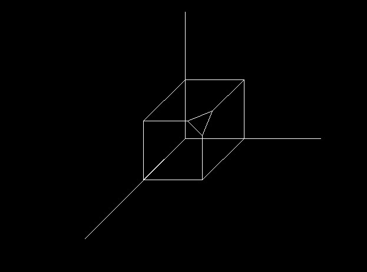
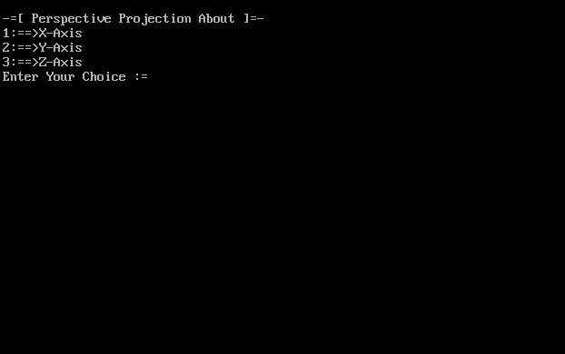
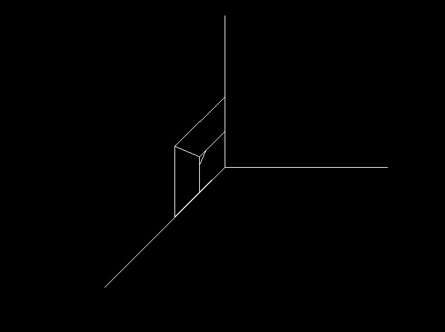
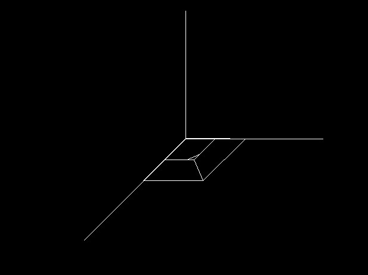
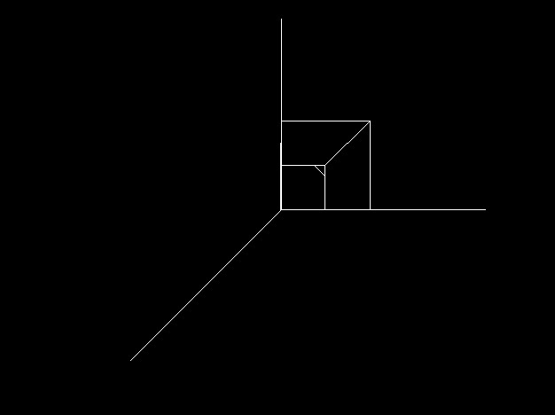

# EX 8 : THREE DIMENSIONAL IMAGE PROJECTIONS

## AIM :
    
  To implement the projections in three dimensional image using a C coding.


## ALGORITHM :

   Step 1 : start.

   Step 2 : Draw any image in the three dimensional plane.

   Step 3 : Get the choice of axis as input from the user.

   Step 4 : Perform the projection about the desired axis.

   Step 5 : Display the projected image.

   Step 6 : Stop.

## Program :
```
#include<stdio.h> 
#include<math.h> 
#include<conio.h> 
#include<stdlib.h> 
#include<graphics.h> 
int gd=DETECT,gm;     
double x1,x2,y1,y2; 
void draw_cube(double edge[20][3]) 
{ 
int i; 
initgraph(&gd, &gm,"c:\\turboc3\\bgi");
clearviewport(); 
for(i=0;i<19;i++) 
{ 
x1=edge[i][0]+edge[i][2]*(cos(2.3562)); 
y1=edge[i][1]-edge[i][2]*(sin(2.3562)); 
x2=edge[i+1][0]+edge[i+1][2]*(cos(2.3562));     
y2=edge[i+1][1]-edge[i+1][2]*(sin(2.3562)); 
line(x1+320,240-y1,x2+320,240-y2);     
} 
line(320,240,320,25); 
line(320,240,550,240); 
line(320,240,150,410); 
getch(); 
closegraph();     
} 
void perspect(double edge[20][3]) 


 { 
 int ch; 
 int i; 
 float p,q,r; 
 clrscr(); 
 printf("\n -=[ Perspective Projection About ]=-"); 
 printf("\n 1:==>X-Axis "); 
 printf("\n 2:==>Y-Axis "); 
 printf("\n 3:==>Z-Axis "); 
 printf("\n Enter Your Choice :="); 
 scanf("%d",&ch); 
 switch(ch) 
  { 
  case 1: 
   printf("\n Enter P :="); 
   scanf("%f",&p); 
   for(i=0;i<20;i++) 
{ 
edge[i][0]=edge[i][0]/(p*edge[i][0]+1); 
edge[i][1]=edge[i][1]/(p*edge[i][0]+1); 
edge[i][2]=edge[i][2]/(p*edge[i][0]+1); 
} 
   draw_cube(edge); 
      break; 
  case 2: 
   printf("\n Enter Q :="); 
   scanf("%f",&q); 
   for(i=0;i<20;i++) 


{ 
edge[i][1]=edge[i][1]/(edge[i][1]*q+1); 
edge[i][0]=edge[i][0]/(edge[i][1]*q+1); 
edge[i][2]=edge[i][2]/(edge[i][1]*q+1); 
} 
   draw_cube(edge); 
   break; 
  case 3: 
   printf("\n Enter R :="); 
   scanf("%f",&r); 
   for(i=0;i<20;i++) 
{ 
edge[i][2]=edge[i][2]/(edge[i][2]*r+1); 
edge[i][0]=edge[i][0]/(edge[i][2]*r+1); 
edge[i][1]=edge[i][1]/(edge[i][2]*r+1); 
} 
   draw_cube(edge); 
   break; 
  } 
 closegraph(); 
 } 
 void main() { 
 int choice; 
 double edge[20][3]= { 
   100,0,0,100,100,0,0,100,0,0,100,100,0,0,100,0,0,0, 
   100,0,0,100,0,100,100,75,100,75,100,100,100,100,75, 
   100,100,0,100,100,75,100,75,100,75,100,100,0,100,100, 
   0,100,0,0,0,0,0,0,100,100,0,100 
}; 
clrscr(); 
draw_cube(edge); 
perspect(edge); 
closegraph(); 
}
```

## Output :




x-axis
P=45

 

y-axis
Q=45

 

z-axis
R=45



## Result :

Thus the projections on the three dimensional images was performed successfully and the output was verified


